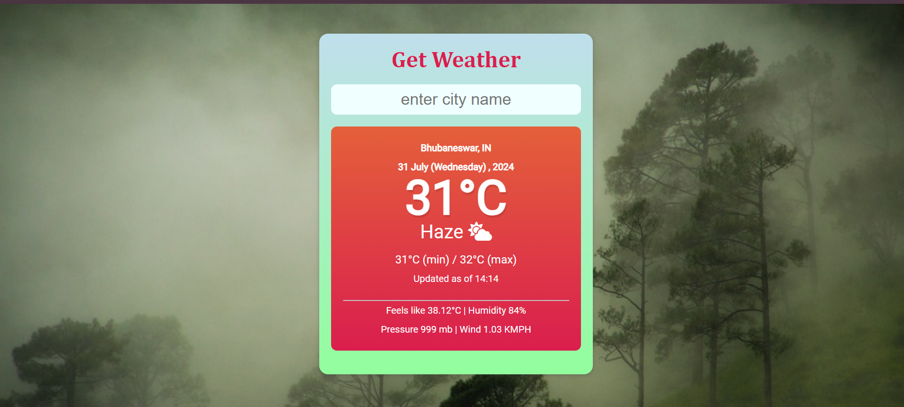
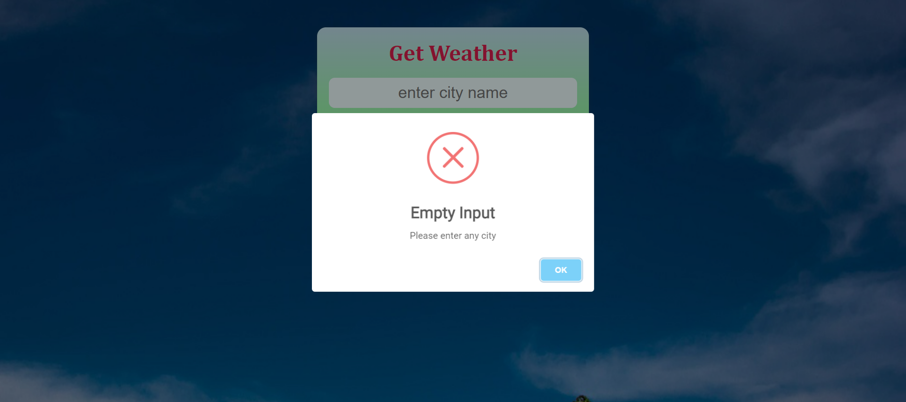

# Weather_App

## I used open weather API to fetch data 

### This web project is done using html,css,and js

#### GitHub link 

https://github.com/MahajanSaiPrasad/Weather-App

### Web Link

https://mahajansaiprasad.github.io/Weather-App/
 
### Features of the project.

* It provides dynamic weather data like temp, minimum and maximum temp etc.
* Dynamic background images change according to weather status.
* Dynamic weather icon change according to weather status.
* It provide basic information like temperature,humidity,pressure,wind speed.
* It will not accept empty input.
* it will give you alert if city name is not matched with api data.
* It has good ux/ui 

### Snapshot

* Default 

* when you enter any valid city
 

* when you did'nt entered anything 
 

* when entered city that did'nt matched with data
 
